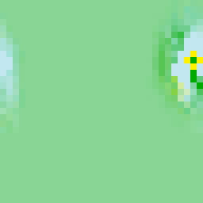

# WaveFunctionCollapse

WaveFunctionCollapse procedurally generates arbitrarily sized images based
on a single example image. It is based on https://github.com/mxgmn/WaveFunctionCollapse.

 -> 

## Installation

Start Julia. Add `WaveFunctionCollapse.jl` with
```julia
] add https://github.com/roberthoenig/WaveFunctionCollapse.jl
```

## Usage

Start Julia.
```julia
> using WaveFunctionCollapse
# ...warnings...
> generate("samples/Flowers.png")
# output Array{RGB{Float32}, 2}
```

For more details and example, see
*   `? generate` in Julia
* [the `usage` Jupyter notebook](usage.ipynb)

## Credits

The WaveFunctionCollapse algorithm was invented by [mxgmn](https://github.com/mxgmn). Their
[WaveFunctionCollapse](https://github.com/mxgmn/WaveFunctionCollapse) repository contains the
original algorithm, and in particular the `samples/` directory that is also included in this
repository. Thus, I include the original credits:

> Some samples are taken from the games Ultima IV and [Dungeon Crawl](https://github.com/crawl/crawl).
Circles tileset is taken from [Mario Klingemann](https://twitter.com/quasimondo/status/778196128957403136).
Idea of generating integrated circuits was suggested to me by [Moonasaur](https://twitter.com/Moonasaur/status/759890746350731264)
and their style was taken from Zachtronics' [Ruckingenur II](http://www.zachtronics.com/ruckingenur-ii/).
Cat overlapping sample is taken from the Nyan Cat video, Qud sample was made by [Brian Bucklew](https://github.com/unormal),
Magic Office + Spirals samples - by rid5x, Colored City + Link + Link 2 + Mazelike + Red Dot + Smile City overlapping samples -
by Arvi Teikari. Summer tileset was made by Hermann Hillmann. Voxel models were rendered in [MagicaVoxel](http://ephtracy.github.io/).